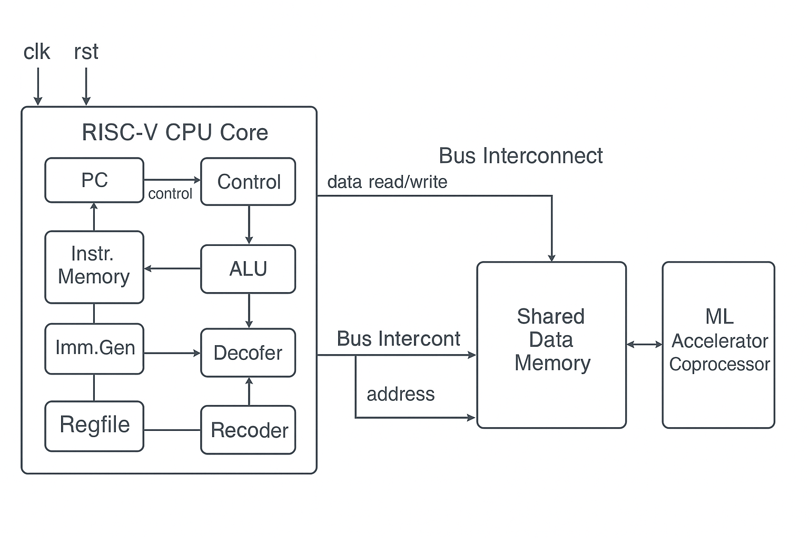
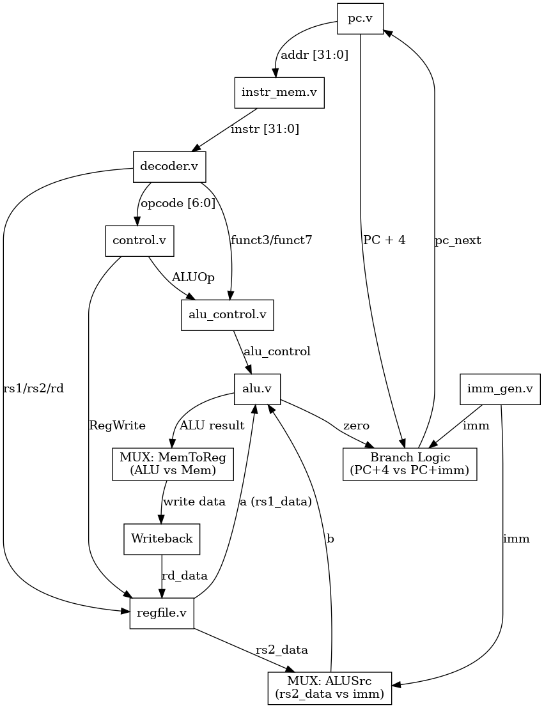

## Work in Progress
This project is under active development. The following components are currently in progress:

| Module       | Description                                   | Status         |
| ------------ | --------------------------------------------- | -------------- |
| `cpu_top.v`    | Top-level CPU datapath integration            | 🧪 Integrated & Functionally Testing     |
| `data_mem.v`  | Data Memory block for loads and stores        | ✅ Tested       |
| `ml_accel.v` | ML Coprocessor (memory-mapped)                | 🔜 Not started |
| `soc_top.v`  | Full SoC wrapper (CPU + Memory + Coprocessor) | 🔜 Not started |


# RISC-V + ML Coprocessor SoC

A custom System-on-Chip (SoC) featuring a minimal RISC-V CPU and a memory-mapped ML accelerator coprocessor. This project is built in Verilog and goes through the full ASIC flow using open-source tools.

---

### 🧩 SoC Top-Level Diagram



### 🧭 CPU Top-Level Block Diagram



## 📁 Folder Structure

- `rtl/` — RTL Verilog source files  
- `testbench/` — Testbenches and simulations  
- `synthesis/` — Yosys synthesis scripts and reports  
- `openlane/` — ASIC layout with OpenLane  
- `doc/` — Block diagrams, FSMs, specs  
- `scripts/` — Custom utilities  
- `results/` — Waveform and layout screenshots  

---

## 🔧 Tools Used

- Verilog, Icarus Verilog, GTKWave  
- Yosys, OpenLane, Magic VLSI  
- Python (for optional scripting/testing)

---

## ✅ Modules Implemented

| Module        | Description                        | Status                           |
|---------------|------------------------------------|----------------------------------|
| `pc.v`        | Program Counter                    | ✅ Tested in Vivado & iverilog   |
| `instr_mem.v` | Instruction Memory (preloaded ROM) | ✅ Tested in Vivado & iverilog   |
| `regfile.v`   | 32-register file with dual-read, single-write port | ✅ Tested in Vivado & iverilog |
| `alu.v`    | Arithmetic Logic Unit (ALU)     | ✅ Tested in Vivado & iverilog |
| `alu_control.v` | ALU Control Decoder | ✅ Tested in Vivado & iverilog |
| `control.v` | Main Control Unit (Opcode decoder) | ✅ Tested in Vivado & iverilog |
| `imm_gen.v` | Immediate Generator (I/S/B/U/J types) | ✅ Tested in Vivado & iverilog |
| `decoder.v` | Instruction field extractor (opcode, rs1, rs2, rd, funct3, funct7) | ✅ Tested in Vivado & iverilog |
| `data_mem.v`  | Read-write Data Memory (word-aligned) | ✅ Tested with SystemVerilog    |
| `cpu_top.v`    | Single-cycle CPU (full datapath)    | 🧪 Integrated, testing `beq`, memory ops |

## 🐞 Known Issues

- ✅ BEQ now correctly calculates the branch offset (imm is left-shifted).
- ⚠️ Data memory (`mem[5]`) not always visible if PC wraps due to reset — might be due to testbench reset signals.
- 🚧 Full program execution is ongoing — `x9` is correctly skipped after branch, but more corner cases still need testing (e.g., SLT, shifts).
- 🔍 No test coverage yet for edge ALU ops like SRA/SRL/SLL or unsigned comparisons.

---

## 📜 Instruction Log (Test Program in `instr_mem.v`)

| PC  | Instruction        | Assembly         | Description                             |
|-----|--------------------|------------------|-----------------------------------------|
| 0   | `0x00500093`       | `addi x1, x0, 5` | x1 = 5                                  |
| 4   | `0x00A00113`       | `addi x2, x0, 10`| x2 = 10                                 |
| 8   | `0x002081B3`       | `add x3, x1, x2` | x3 = x1 + x2 = 15                        |
| 12  | `0x40110233`       | `sub x4, x2, x1` | x4 = x2 - x1 = 5                         |
| 16  | `0x0020A2B3`       | `and x5, x1, x2` | x5 = x1 & x2 = 0                         |
| 20  | `0x0020B333`       | `or x6, x1, x2`  | x6 = x1 | x2 = 15                        |
| 24  | `0x0020C3B3`       | `xor x7, x1, x2` | x7 = x1 ^ x2 = 15                        |
| 28  | `0x0070A023`       | `sw x7, 0(x1)`   | mem[x1+0] = x7 = 15                      |
| 32  | `0x0000A403`       | `lw x8, 0(x1)`   | x8 = mem[x1+0] → should get 15          |
| 36  | `0x00410663`       | `beq x2, x4, +8` | Branch if x2 == x4 → skip next if false |
| 40  | `0x06300493`       | `addi x9, x0, 99`| x9 = 99 (should be skipped if branch)   |
| 44  | `0x0010A533`       | `add x10, x1, x1`| x10 = x1 + x1 = 10                       |

## ▶️ Running Simulations (Linux)

### ▶️ Simulate the PC module:
```bash
cd testbench
iverilog -o pc_test pc_tb.v ../rtl/pc.v
./pc_test
gtkwave pc.vcd
```

### ▶️ Simulate the Instruction Memory module
```bash
cd testbench
iverilog -o instr_mem_test instr_mem_tb.v ../rtl/instr_mem.v
./instr_mem_test
gtkwave instr_mem.vcd
```

### ▶️ Simulate the Register File Module
```bash
cd testbench
iverilog -o regfile_test regfile_tb.v ../rtl/regfile.v
./regfile_test
gtkwave regfile.vcd
```
### ▶️ Simulate the ALU Module

```bash
cd testbench
iverilog -g2012 -o alu_test alu_tb.sv ../rtl/alu.v
./alu_test > alu_output.txt
gtkwave alu.vcd
```
### ▶️ Simulate the ALU Control Module
```bash
cd testbench
iverilog -g2012 -o alu_control_test alu_control_tb.sv ../rtl/alu_control.v
./alu_control_test > alu_control_output.txt
gtkwave alu_control.vcd
```
### ▶️ Simulate the Main Control Unit Module
```bash
cd testbench
iverilog -g2012 -o control_test control_tb.sv ../rtl/control.v
./control_test > control_output.txt
gtkwave control.vcd
```
### ▶️ Simulate the Immediate Generator Module
```bash
cd testbench
iverilog -g2012 -o imm_gen_test imm_gen_tb.sv ../rtl/imm_gen.v
./imm_gen_test
```
### ▶️ Simulate Decoder Module
```bash
cd testbench
iverilog -g2012 -o decoder_test decoder_tb.sv ../rtl/decoder.v
./decoder_test > decoder_output.txt
gtkwave decoder.vcd
```